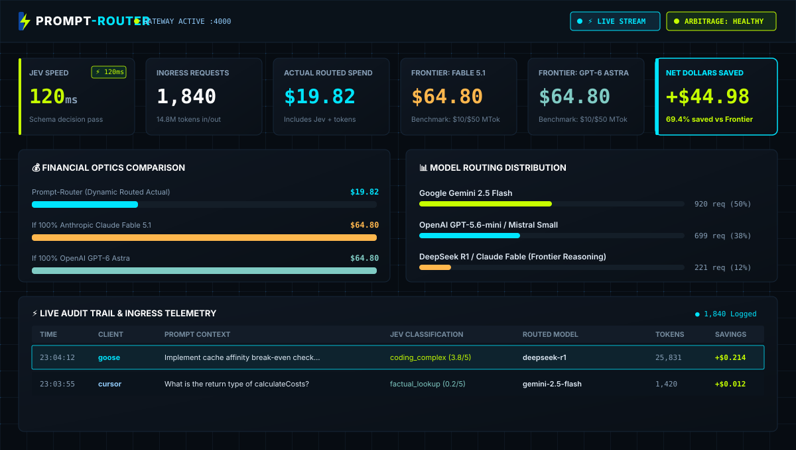

<div align="center">
  

  <h3>⚡ The LLM Router That Knows When <i>Not</i> to Switch ⚡</h3>

  <p align="center">
    <a href="https://github.com/robinwintertaylor/Prompt-Router"></a>
    <a href="https://github.com/robinwintertaylor/Prompt-Router"></a>
    <a href="https://github.com/robinwintertaylor/Prompt-Router"></a>
    <a href="https://github.com/robinwintertaylor/Prompt-Router"></a>
    <a href="LICENSE"></a>
  </p>

  <p align="center">
    <b>Schema-constrained routing across 540+ models using TypeSafe Jev System One.</b><br />
    <i>Drop-in replacement for OpenAI API endpoints with real-time HUD optics and token telemetry.</i>
  </p>
</div>

---

## 🌀 Why Naive LLM Routers Break Coding Agents

Most LLM routers evaluate every prompt in isolation. For single-turn chat, that works. **For coding agents (Goose, Cursor, VS Code Continue), it is economically broken.**

Coding agents accumulate massive multi-turn conversation threads (15k to 100k+ tokens) containing repository maps, tool outputs, and code diffs. Modern frontier providers offer **75% to 90% prompt caching discounts**:
* **Frontier Anchor (e.g. Claude Fable 5.1 / GPT-6 Astra)**: $1.00/M cached input vs $10.00/M uncached (90% discount)
* **DeepSeek R1 / V3**: $0.07/M cached input vs $0.55/M uncached (87% discount)

### The Cache-Thrashing Paradox
Consider an ongoing coding session with 60,000 tokens of context cached on a frontier anchor model ($1.00/M cached rate):
* **Staying Anchored**: $60,000 \times \$1.00/\text{M} = \mathbf{\$0.060}$.
* **Naive Switch to Mid-Tier Coder** ($1.50/M uncached): $60,000 \times \$1.50/\text{M} = \mathbf{\$0.090}$ (paying 50% more to use a weaker model).
* **Naive Switch to Ultra-Cheap Flash** ($0.03/M uncached): The single turn looks cheap at $60,000 \times \$0.03/\text{M} = \mathbf{\$0.0018}$. **However**, provider prompt caches expire after a 5-minute inactivity TTL. While the developer reviews the Flash output, the anchor cache expires. When the next coding turn arrives, re-establishing the anchor cache incurs a full cache-write penalty ($10.00/M, or **$0.600**).
  $$\text{Round-Trip Detour Cost} = \$0.0018 \text{ (Flash)} + \$0.600 \text{ (Anchor Rebuild)} = \mathbf{\$0.6018}$$
  Staying anchored on the frontier model costs only **$0.060**. A naive detour intended to save pennies costs **10× more**!

### Prompt-Router's Solution: Break-Even Cache Affinity
Instead of static rules or naive switching, Prompt-Router computes a **real-time break-even check**:

$$\text{Expected Switch Cost} = \text{Cost}_{\text{candidate}}^{\text{uncached}} + \left(P_{\text{rebuild}} \times \text{Cost}_{\text{anchor}}^{\text{rebuild}}\right)$$

* **Where Staying Wins (Active Coding Loops)**: In an active multi-turn thread ($P_{\text{rebuild}} \approx 1.0$), the anchor cache is retained. Switching to an uncached candidate is rejected unless the candidate's cost plus expected rebuild penalty beats the warm anchor rate. Staying anchored is **70% to 90% cheaper**.
* **Where Switching Wins**:
  1. **Pre-Cache Contexts (<4,000 tokens)**: Early in a thread before provider prompt caching activates ($P_{\text{rebuild}} = 0$). Simple lookups route to Flash/Mini tiers for pure 95% savings.
  2. **Terminal Turns / Isolated Queries**: Standalone tool executions or end-of-task summaries where no subsequent turn will require the anchor context ($P_{\text{rebuild}} = 0$).
* **Reasoning Override**: Dedicated chain-of-thought models (DeepSeek R1) override the anchor whenever Jev detects formal algorithmic or mathematical reasoning ($\ge 0.70$), prioritizing cognitive capability over cache retention.

---
## 🛡️ Calibrated Confidence & The 0.60 Rule

We do not claim "zero hallucinations"—routers can misclassify, and whichever model they pick can hallucinate. On TypeSafe's four-workflow benchmark, Jev scores approximately **68% accuracy**, roughly level with mid-tier language models.

**Prompt-Router makes this production-safe through the 0.60 Confidence Gate**:
* **Deterministic Schema Primitives**: Jev evaluates prompts using non-autoregressive primitives (`choice`, `score`, `noul`) in ~120ms for $0.042/M tokens (free completion).
* **Probability Calibration**: Jev outputs explicit confidence distributions on every turn (`intent_confidence`, `complexity_confidence`).
* **The 0.60 Rule**: If Jev's confidence on intent or complexity falls below `0.60`, Prompt-Router **refuses to downgrade** to a lightweight flash tier. Instead, it automatically elevates the query to frontier safeguard models (**Claude Fable 5.1** or **GPT-6 Astra**), ensuring complex code instructions never execute on an underpowered model.

---

## 📊 7-Day Developer Case Study (Methodology & Numbers)

### Methodology & Token Accounting
* **Workload**: 1,840 recorded queries from a single developer over 7 consecutive working days building a full-stack TypeScript/React/Node repository with Goose AI Agent and Cursor IDE.
* **Token Breakdown**:
  * Uncached prompt tokens: **1.2M**
  * Cached prompt tokens: **12.8M** (average context 42k tokens on active multi-turn threads)
  * Completion output tokens: **0.8M**
  * Total tokens processed: **14.8M**
* **Baseline Arithmetic**:
  * *All-Frontier Baseline (Claude Fable 5.1 / GPT-6 Astra)*: $1.2\text{M} \times \$10.00/\text{M} \text{ (uncached)} + 12.8\text{M} \times \$1.00/\text{M} \text{ (cached)} + 0.8\text{M} \times \$50.00/\text{M} \text{ (output)} = \mathbf{\$64.80}$.
  * *Naive Router (No Cache Affinity)*: Frequent model detours triggered repeated 5-minute TTL cache evictions, causing $14.20 in cache-rebuild penalties and $38.40 total spend.
  * *Prompt-Router (Break-Even + 0.60 Gate)*: Anchor retention preserved 12.1M tokens in cache, spending $19.20 on models and $0.62 on Jev System One for **$19.82 total spend (-69.4% vs Frontier)**.

| Metric | All-Frontier Baseline (Claude Fable / GPT-6 Astra) | Naive Router (No Cache Affinity) | Prompt-Router (Break-Even + 0.60 Gate) |
| :--- | :--- | :--- | :--- |
| **Gross Spend** | **$64.80** | **$38.40** | **$19.82 (-69.4% vs Frontier)** |
| **Frontier Reasoning** | 100% (1,840) | 18% (331) | 12% (221) |
| **Balanced Coding** | 0% | 42% (773) | 38% (699) |
| **Fast / Cheap Lookup** | 0% | 40% (736) | 50% (920) |
| **Cache Rebuild Penalty** | $0.00 (Anchored) | $14.20 (Frequent TTL evictions) | **$1.10 (Protected Affinity)** |
| **Ambiguous Turns Elevated**| N/A | 0 (Failed on Flash) | **41 turns elevated by 0.60 gate** |
| **Manual Turn Retries** | 8 turns | 34 turns (weak model errors) | **14 turns** |

*(Run `npm test` to execute the reproducible simulation suite validating break-even cache affinity and confidence gating).*

---

## 📺 Live HUD Optics & Real-Time Dashboard

Prompt-Router includes a high-fidelity optics dashboard (**Concept 1: The Parallel Junction**) styled in Gateway Teal (`#0D47A1`), Jev Yellow-Green (`#C6FF00`), and dark schematic grids.

<div align="center">
  
</div>

<details>
<summary><b>View ASCII Terminal HUD Layout</b></summary>

```
+------------------------------------------------------------------------------------+
|  PROMPT-ROUTER              ⚡ LIVE STREAM  ● ARBITRAGE: HEALTHY    [Settings] [Theme]
+------------------------------------------------------------------------------------+
|  [ Total Requests ]   [ Actual Spend ]   [ Cost if All-Frontier ]  [ Net Dollars Saved ]
|        1,840              $19.8200               $64.8000                +$44.9800  
|    14.8M tokens in/out  Jev + Models           $10/$50 per MTok        69.4% reduction
+------------------------------------------------------------------------------------+
|  [ REAL-TIME COST COMPARISON ]                 [ MODEL ROUTING DISTRIBUTION ]      
|  Prompt-Router Actual: [==] $19.82             • Gemini 2.5 Flash:  920 (50%)      
|  If 100% Frontier:     [==========] $64.80     • GPT-5.6-mini:      699 (38%)      
|                                                • DeepSeek R1/Astra: 221 (12%)      
+------------------------------------------------------------------------------------+
```
</details>
*(Backed by native Server-Sent Events `/api/telemetry/stream`—counters pulse and audit rows slide in with glowing animations in under 100ms without page refreshes.)*

---


## 🏗️ Architecture & Credential-Aware Dispatch

**Core Principle: Jev decides the model, not the provider.**  
Prompt-Router never steers or constrains Jev's cognitive choice. Instead, once Jev evaluates prompt difficulty and selects the winning model, the **Execution Dispatcher** resolves the optimal endpoint:
1. **Direct Vendor Credentials**: If you have direct keys for the model's creator (**Anthropic**, **OpenAI**, **Mistral AI** for EU sovereignty, **DeepSeek**, or **Google Gemini**), Prompt-Router dispatches directly to their API—bypassing aggregators, eliminating middle-man latency, and using your existing subscriptions.
2. **Aggregator Pool**: If no direct key is configured, requests route seamlessly through **Mammouth AI** or **OpenRouter** with real-time health arbitrage and automated failover.
3. **Enterprise Cloud**: Corporate workloads bridge into **Azure AI Foundry** with Microsoft Entra ID and Private Link VNet isolation.

```
+---------------------------------------------------------------------------------------+
|                                  DEVELOPER CLIENTS                                    |
|         Goose Agent · Cursor (via Tunnel) · VS Code (Cline/Continue) · SDKs           |
+-------------------------------------------+-------------------------------------------+
                                            |
                                            | POST /v1/chat/completions
                                            v
+---------------------------------------------------------------------------------------+
|                                PROMPT-ROUTER GATEWAY                                  |
|                                                                                       |
|  +--------------------+   +-----------------------+   +-----------------------------+ |
|  | Context & Session  |-->| Jev System One Client |-->| Break-Even Cache Affinity   | |
|  | Fingerprinting     |   | (~120ms non-autoregr.)|   | & 0.60-Gated Safety Router  | |
|  +--------------------+   +-----------------------+   +--------------+--------------+ |
|                                                                      |                |
|  +--------------------+   +-----------------------+                  |                |
|  | Live SSE Telemetry |<--| Financial Accounting  |<-----------------+                |
|  | (/api/telemetry)   |   | & In-Memory Arbitrage |                                   |
|  +--------------------+   +-----------------------+                                   |
+-------------------------------------------+-------------------------------------------+
                                            |
                    +-----------------------+-----------------------+
                    |                       |                       |
                    v                       v                       v
+-----------------------+   +-----------------------+   +-----------------------+
|    DIRECT VENDORS     |   |      AGGREGATORS      |   |   ENTERPRISE CLOUD    |
| Anthropic · OpenAI    |   | Mammouth AI (France)  |   | Azure AI Foundry      |
| Mistral (EU) · Google |   | OpenRouter (540+)     |   | Entra ID / Private    |
| DeepSeek Direct       |   | Rate Arbitrage & Fail |   | Sovereign Boundaries  |
+-----------------------+   +-----------------------+   +-----------------------+
```

### Supported Models (Configurable)
* **Premier Frontier Targets**: `anthropic/claude-fable-5.1`, `openai/gpt-6-astra` ($10/M in, $50/M out).
* **Dedicated Reasoning**: `deepseek/deepseek-r1` ($0.55/M in, $2.19/M out).
* **Balanced Coding**: `openai/gpt-5.6-mini`, `mistralai/mistral-small` ($0.15/M in, $0.60/M out).
* **Fast / Cheap**: `google/gemini-2.5-flash`, `deepseek/deepseek-v4-flash` ($0.03–$0.075/M in).
* *Note*: All rate cards and benchmark comparison baselines are fully configurable in `prompt_router.db` via `/api/settings`.

---

## ⚡ Quickstart & Integrations

### 1. Installation & Start
```bash
git clone https://github.com/robinwintertaylor/Prompt-Router.git
cd Prompt-Router
npm install
npm run build
npm start   # Starts on http://localhost:4000
```

### 2. Configure Credentials (via Dashboard or .env)
Configure keys either in `.env` or in the dashboard **Settings Modal** (`http://localhost:4000`):

```env
# 1. Non-Autoregressive Decision Engine
TYPESAFE_API_KEY=ts_live_...       # https://typesafe.ai (120ms Jev System One)

# 2. Direct Vendor Accounts (Optional - uses your existing subscriptions)
MISTRAL_API_KEY=...                # https://console.mistral.ai (EU data residency)
ANTHROPIC_API_KEY=...              # https://console.anthropic.com
OPENAI_API_KEY=...                 # https://platform.openai.com
DEEPSEEK_API_KEY=...               # https://platform.deepseek.com
GEMINI_API_KEY=...                 # https://aistudio.google.com

# 3. Fallback Aggregators & Enterprise Cloud
OPENROUTER_API_KEY=sk-or-v1-...    # https://openrouter.ai (540+ models)
MAMMOUTH_API_KEY=sk-mammouth-...   # https://mammouth.ai (France)
AZURE_AI_FOUNDRY_ENDPOINT=...      # https://<resource>.services.ai.azure.com/models
AZURE_AI_FOUNDRY_KEY=...           # Entra ID Bearer token or Azure API key
```

### 3. Connect Your Coding Agent
* **Goose AI Agent**: Already pre-configured on install. Run:
  ```bash
  goose session --provider custom_prompt_router --model auto
  ```
* **Cursor IDE (Requires Public Tunnel)**:
  > ⚠️ Cursor resolves custom OpenAI base URLs **server-side from Cursor's cloud**, not locally. Run `ngrok http 4000` and paste `https://xxxx.ngrok-free.app/v1` into *Cursor Settings ➔ Models ➔ OpenAI Base URL*. Add model `auto`.
* **VS Code (Continue / Cline / Roo Code)**: Set provider to `OpenAI Compatible`, Base URL to `http://localhost:4000/v1`, and model to `auto`.

---

## 📄 License

Open-source under the **[MIT License](LICENSE)**.
