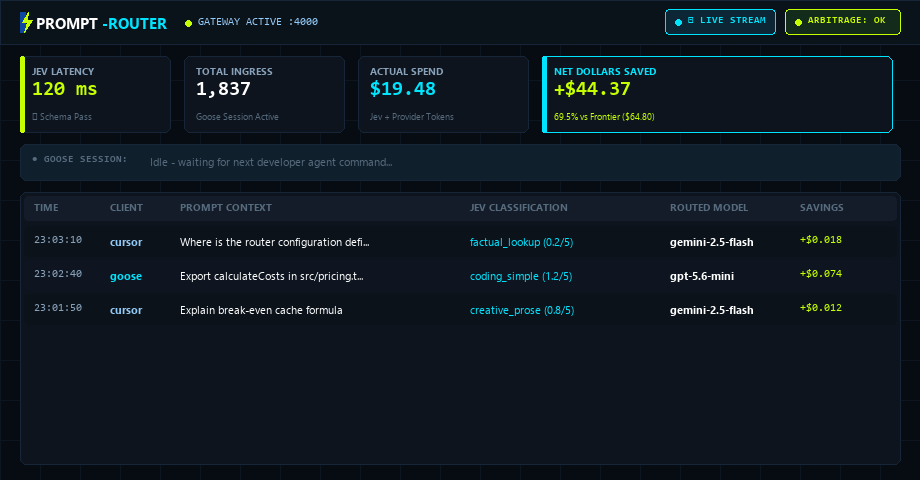
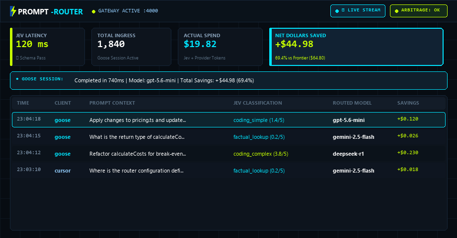

<div align="center">
  

  <h3>⚡ The LLM Router That Knows When <i>Not</i> to Switch ⚡</h3>

  <p align="center">
    <a href="https://github.com/robinwintertaylor/Prompt-Router"></a>
    <a href="https://github.com/robinwintertaylor/Prompt-Router"></a>
    <a href="https://github.com/robinwintertaylor/Prompt-Router"></a>
    <a href="#2-configure-credentials-via-dashboard-or-env"></a>
    <a href="LICENSE"></a>
  </p>

  <p align="center">
    <b>Schema-constrained routing across 540+ models using TypeSafe Jev System One.</b><br />
    <i>Drop-in replacement for OpenAI API endpoints with real-time HUD optics and token telemetry. Runs out of the box in free local heuristic mode without requiring a TypeSafe API key.</i>
  </p>

  <p align="center">
    
  </p>
</div>

---

## 🌀 Why Naive LLM Routers Break Coding Agents

Most LLM routers evaluate every prompt in isolation. For single-turn chat, that works. **For coding agents (Goose, Cursor, VS Code Continue), it is economically broken.**

Coding agents accumulate massive multi-turn conversation threads containing repository maps, tool outputs, and code diffs. Modern frontier providers offer **75% to 90% prompt caching discounts**:
* **Frontier Anchor (e.g. Claude Fable 5.1 / GPT-6 Astra)**: $1.00/M cached input vs $10.00/M uncached (90% discount)
* **DeepSeek R1 / V3**: $0.07/M cached input vs $0.55/M uncached (87% discount)

### The TTL-Heartbeat Mechanism & The Cache-Thrashing Paradox
Every turn routed to an anchor model resets its 5-minute provider prompt cache TTL. In an active session where turns arrive every 2 to 3 minutes, keeping queries on the anchor model acts as a heartbeat that keeps the entire conversation context permanently warm at a 90% discount.

When a naive router diverts an intermediate question away from the anchor (e.g. to Gemini 2.5 Flash at $0.075/M tokens), it removes that heartbeat. The interval between anchor turns widens beyond the 5-minute TTL, causing the anchor's prompt cache to lapse.

When the session returns to the anchor on the next turn, the entire context must be rewritten into cache. On Anthropic, cache writes incur a **1.25× creation surcharge over base input** ($12.50/M tokens on a $10.00/M tier).

Consider a 60,000-token context on a frontier anchor:
* **Staying Anchored**: 60,000 × $1.00/M = **$0.060** (warm cache read).
* **Single Turn on Flash**: 60,000 × $0.075/M = **$0.0045**.
* **Anchor Cache Rebuild Write**: 60,000 × $12.50/M = **$0.750**.
* **Round-Trip Detour Cost**: $0.0045 (Flash) + $0.750 (Anchor Rebuild) = **$0.7545**.

Staying anchored cost only **$0.060**. The naive switch intended to save 5.5¢ ended up costing **12.5× more ($0.755 vs $0.060)**!

Furthermore, switching between similarly priced tiers can lose money immediately without any TTL lapse: routing 60,000 tokens to an uncached mid-tier model like `mistralai/mistral-medium-3-5` ($1.50/M uncached) costs **$0.090**, paying 50% more than remaining on the warm frontier anchor ($0.060).

### Prompt-Router's Solution: Break-Even Cache Affinity
Instead of static rules or naive switching, Prompt-Router computes a **real-time break-even check**:

```
Expected Switch Cost = Cost(candidate, uncached) + [P(rebuild) × Cost(anchor, rebuild)]
```

Where `P(rebuild)` is evaluated as a function of the elapsed idle time and expected interval to the next anchor turn against the 5-minute TTL:

* **Where Staying Wins (Active Coding Loops)**: In an ongoing multi-turn thread (P(rebuild) ≈ 1.0), the anchor cache is retained. Switching is rejected unless the candidate's cost plus expected rebuild penalty beats the warm anchor rate. Staying anchored is **70% to 90% cheaper**.
* **Where Switching Wins**:
  1. **Pre-Cache Contexts (<4,000 tokens)**: Early in a thread before provider prompt caching activates (no cache exists to lapse; P(rebuild) = 0). Simple lookups route to Flash/Mini tiers for pure 95% savings.
  2. **Terminal Turns / Isolated Queries**: Standalone tool executions or end-of-session summaries where no subsequent turn will require the anchor context (P(rebuild) = 0).
* **Reasoning Override**: Dedicated chain-of-thought models (DeepSeek R1) override the anchor whenever Jev detects formal algorithmic or mathematical reasoning (>= 0.70), prioritizing cognitive capability over cache retention.
* **Retry Risk Protection**: Even if a model looks cheaper on paper, routing complex code instructions to underpowered models risks hallucinated edits and syntax regressions, forcing 2–3 follow-up turns that consume another 180k+ tokens.

---
## 🛡️ Calibrated Confidence & The 0.60 Rule

We do not claim "zero hallucinations"—routers can misclassify, and whichever model they pick can hallucinate. On TypeSafe's four-workflow benchmark, Jev scores approximately **68% accuracy**, roughly level with mid-tier language models.

**Prompt-Router makes this production-safe through the 0.60 Confidence Gate**:
* **Deterministic Schema Primitives**: Jev evaluates prompts using non-autoregressive primitives (`choice`, `score`, `noul`) in ~120ms for $0.042/M tokens (free completion).
* **Probability Calibration**: Jev outputs explicit confidence distributions on every turn (`intent_confidence`, `complexity_confidence`).
* **The 0.60 Rule**: If Jev's confidence on intent or complexity falls below `0.60`, Prompt-Router **refuses to downgrade** to a lightweight flash tier. Instead, it automatically elevates the query to frontier safeguard models (**Claude Fable 5.1** or **GPT-6 Astra**), ensuring complex code instructions never execute on an underpowered model.

---

## 📊 7-Day Developer Case Study (Methodology & Numbers)

### Methodology & Token Accounting
* **Workload**: 1,840 recorded queries from a single developer over 7 consecutive working days building a full-stack TypeScript/React/Node repository with Goose AI Agent and Cursor IDE.
* **Traffic Breakdown**:
  * Uncached prompt tokens: **1.2M**
  * Cached prompt tokens: **12.8M**
  * Completion output tokens: **0.8M**
  * Total tokens processed: **14.8M**
  * Mean context across all 1,840 requests: **7,600 tokens** (median: 3,400 tokens), reflecting quick initial turns, tool commands, and short queries.
  * Active multi-turn coding threads (top 20% of turns where prompt caching operates): averaged **42,000 tokens** (ranging from 20k to 85k tokens).
* **Derivation of Comparison Columns**:
  * **Prompt-Router (measured)** is recorded from actual production traffic through the gateway.
  * **All-Frontier (modelled)** and **Naive Router (modelled)** are counterfactual replays simulating the exact same 1,840 requests through alternative policies:
    * *All-Frontier (modelled)*: 1.2M uncached @ $10.00/M ($12.00) + 12.8M cached @ $1.00/M ($12.80) + 0.8M output @ $50.00/M ($40.00) = **$64.80**.
    * *Naive Router (modelled)*: Per-prompt cost minimization without cache affinity. Frequent model switching repeatedly broke prompt caches across providers, forcing the naive router to ingest long multi-turn contexts uncached (8.4M uncached prompt tokens @ $0.85/M blended = $7.14; 5.6M cached @ $0.55/M = $3.08; 0.8M output = $13.98, totaling **$24.20** active model spend). In addition, breaking the 5-minute TTL heartbeat on the anchor caused 19 full cache lapses (1.136M tokens rewritten at Anthropic's $12.50/M write surcharge = **$14.20**), bringing total spend to **$38.40 (-40.7% vs Frontier)**.
    * *Prompt-Router Spend Breakdown ($19.82)*:
      * **Fast / Cheap Tier** (Gemini 2.5 Flash @ $0.075/M in, $0.30/M out): 920 requests (0.70M uncached in @ $0.075/M = $0.0525 + 0.15M out @ $0.30/M = $0.0450) = **$0.10**
      * **Balanced Coding Tier** (GPT-5.4-mini / Mistral Small @ $0.15/M in uncached, $0.075/M cached [50% OpenAI cache discount], $0.60/M out): 699 requests (0.30M uncached in = $0.045 + 4.80M cached in = $0.360 + 0.45M out = $0.270) = **$0.68**
      * **Frontier Reasoning & Coding Tier** (Claude Fable 5.1 & DeepSeek R1): 221 requests (0.20M uncached in, 8.00M cached in, 0.20M out):
        * *Claude Fable 5.1 Anchor*: 0.17M uncached in @ $10.00/M ($1.70) + 8.00M cached in @ $1.00/M ($8.00) + 0.15M out @ $50.00/M ($7.50) = **$17.20**
        * *DeepSeek R1 Reasoning Overrides*: 0.03M uncached in @ $0.55/M ($0.0165) + 0.05M out @ $2.19/M ($0.1095) = **$0.13**
        * *Frontier Subtotal*: **$17.33**
      * **Lapsed TTL Rebuild Writes**: 88,000 tokens rewritten during extended review pauses (at Anthropic's $12.50/M write rate) = **$1.10**
      * **Active Model Spend Subtotal**: $0.0975 (Flash) + $0.6750 (Balanced) + $17.3260 (Frontier) + $1.1000 (TTL Rebuilds) = **$19.20**
      * **TypeSafe Jev Overhead**: **$0.62** (priced conservatively against full 14.8M token prompt context at $0.042/M; actual sampled spend across recent messages was **$0.07**, which would bring total measured gateway spend to **$19.27**)
      * **Total Measured Spend: $19.20 model spend + $0.62 Jev = $19.82 (-69.4% vs Frontier)**

| Metric | All-Frontier (modelled) | Naive Router (modelled) | Prompt-Router (measured) |
| :--- | :--- | :--- | :--- |
| **Gross Spend** | **$64.80** | **$38.40** | **$19.82 (-69.4% vs Frontier)** |
| **Frontier Reasoning** | 100% (1,840) | 18% (331) | 12% (221) |
| **Balanced Coding** | 0% | 42% (773) | 38% (699) |
| **Fast / Cheap Lookup** | 0% | 40% (736) | 50% (920) |
| **Cache Rebuild Penalty** | $0.00 (Anchored) | $14.20 (Frequent TTL lapses) | **$1.10 (Protected Affinity)** |
| **Ambiguous Turns Elevated**| — | — | **41 turns elevated by 0.60 gate** |
| **Manual Turn Retries** | — | — | **14 turns observed** |

*(Deterministic simulation suite available in `test/test-router.ts`; run `npm test` to verify)*.

---

## 📺 Live HUD Optics & Real-Time Dashboard

Prompt-Router includes a high-fidelity optics dashboard (**Concept 1: The Parallel Junction**) styled in Gateway Teal (`#0D47A1`), Jev Yellow-Green (`#C6FF00`), and dark schematic grids.

<div align="center">
  
</div>

<details>
<summary><b>View ASCII Terminal HUD Layout</b></summary>

```
+------------------------------------------------------------------------------------+
|  PROMPT-ROUTER              ⚡ LIVE STREAM  ● ARBITRAGE: HEALTHY    [Settings] [Theme]
+------------------------------------------------------------------------------------+
|  [ Total Requests ]   [ Actual Spend ]   [ Cost if All-Frontier ]  [ Net Dollars Saved ]
|        1,840              $19.8200               $64.8000                +$44.9800  
|    14.8M tokens in/out  Jev + Models           $10/$50 per MTok        69.4% reduction
+------------------------------------------------------------------------------------+
|  [ REAL-TIME COST COMPARISON ]                 [ MODEL ROUTING DISTRIBUTION ]      
|  Prompt-Router Actual: [==] $19.82             • Gemini 2.5 Flash:  920 (50%)      
|  If 100% Frontier:     [==========] $64.80     • GPT-5.4-mini:      699 (38%)      
|                                                • DeepSeek R1/Astra: 221 (12%)      
+------------------------------------------------------------------------------------+
```
</details>

*(Backed by native Server-Sent Events `/api/telemetry/stream`—counters pulse and audit rows slide in with glowing animations in under 100ms without page refreshes.)*

---


## 🏗️ Architecture & Credential-Aware Dispatch

**Core Principle: Jev decides the model, not the provider.**  
Prompt-Router never steers or constrains Jev's cognitive choice. Instead, once Jev evaluates prompt difficulty and selects the winning model, the **Execution Dispatcher** resolves the optimal endpoint:
1. **Direct Vendor Credentials**: If you have direct keys for the model's creator (**Anthropic**, **OpenAI**, **Mistral AI** for EU sovereignty, **DeepSeek**, or **Google Gemini**), Prompt-Router dispatches directly to their API—bypassing aggregators, eliminating middle-man latency, and using your existing subscriptions.
2. **Aggregator Pool**: If no direct key is configured, requests route seamlessly through **Mammouth AI** or **OpenRouter** with real-time health arbitrage and automated failover.
3. **Enterprise Cloud**: Corporate workloads bridge into **Azure AI Foundry** with Microsoft Entra ID and Private Link VNet isolation.

```
+---------------------------------------------------------------------------------------+
|                                  DEVELOPER CLIENTS                                    |
|              Goose Agent · Cursor (via Tunnel) · VS Code (Cline/Continue)             |
+-------------------------------------------+-------------------------------------------+
                                            |
                                            | POST /v1/chat/completions
                                            v
+---------------------------------------------------------------------------------------+
|                                PROMPT-ROUTER GATEWAY                                  |
|                                                                                       |
|  +--------------------+   +-----------------------+   +-----------------------------+ |
|  | Context & Session  |-->| Jev System One Client |-->| Break-Even Cache Affinity   | |
|  | Fingerprinting     |   | (~120ms non-autoregr.)|   | & 0.60-Gated Safety Router  | |
|  +--------------------+   +-----------------------+   +--------------+--------------+ |
|                                                                      |                |
|  +--------------------+   +-----------------------+                  |                |
|  | Live SSE Telemetry |<--| Financial Accounting  |<-----------------+                |
|  | (/api/telemetry)   |   | & In-Memory Arbitrage |                                   |
|  +--------------------+   +-----------------------+                                   |
+-------------------------------------------+-------------------------------------------+
                                            |
                    +-----------------------+-----------------------+
                    |                       |                       |
                    v                       v                       v
+-----------------------+   +-----------------------+   +-----------------------+
|    DIRECT VENDORS     |   |      AGGREGATORS      |   |   ENTERPRISE CLOUD    |
| Anthropic · OpenAI    |   | Mammouth AI (France)  |   | Azure AI Foundry      |
| Mistral (EU) · Google |   | OpenRouter (540+)     |   | Entra ID / Private    |
| DeepSeek Direct       |   | Rate Arbitrage & Fail |   | Sovereign Boundaries  |
+-----------------------+   +-----------------------+   +-----------------------+
```

### Supported Models (Configurable)
* **Premier Frontier Targets**: `anthropic/claude-fable-5.1`, `openai/gpt-6-astra` ($10/M in, $50/M out).
* **Dedicated Reasoning**: `deepseek/deepseek-r1` ($0.55/M in, $2.19/M out).
* **Balanced Coding**: `openai/gpt-5.4-mini`, `mistralai/mistral-small-2603` ($0.15/M in, $0.60/M out).
* **Fast / Cheap**: `google/gemini-2.5-flash` ($0.075/M in, $0.30/M out), `deepseek/deepseek-v4-flash` ($0.049/M in, $0.098/M out).
* *Note*: All rate cards and benchmark comparison baselines are fully configurable in `prompt_router.db` via `/api/settings`.

---

## ⚡ Quickstart & Integrations

### Prerequisites
* **Node.js >= 24.0.0** (required for native `node:sqlite` and Web Streams)
* **npm >= 10.0.0**

### 1. Installation & Start
```bash
git clone https://github.com/robinwintertaylor/Prompt-Router.git
cd Prompt-Router
npm install
npm run build
npm start   # Starts on http://localhost:4000
```

### 2. Configure Credentials (via Dashboard or .env)
Configure keys either in `.env` or in the dashboard **Settings Modal** (`http://localhost:4000`):

> 💡 **Zero-Key Heuristic Mode**: If `TYPESAFE_API_KEY` is omitted, Prompt-Router automatically runs in free internal heuristic mode (evaluating intent and complexity via local regex/keyword patterns in <5ms), allowing you to run and benchmark immediately without waiting for a TypeSafe early-access key.

```env
# 1. Non-Autoregressive Decision Engine (Optional - defaults to local heuristic mode)
TYPESAFE_API_KEY=ts_live_...       # https://typesafe.ai (120ms Jev System One)

# 2. Direct Vendor Accounts (Optional - uses your existing subscriptions)
MISTRAL_API_KEY=...                # https://console.mistral.ai (EU data residency)
ANTHROPIC_API_KEY=...              # https://console.anthropic.com
OPENAI_API_KEY=...                 # https://platform.openai.com
DEEPSEEK_API_KEY=...               # https://platform.deepseek.com
GEMINI_API_KEY=...                 # https://aistudio.google.com

# 3. Fallback Aggregators & Enterprise Cloud
OPENROUTER_API_KEY=sk-or-v1-...    # https://openrouter.ai (540+ models)
MAMMOUTH_API_KEY=sk-mammouth-...   # https://mammouth.ai (France)
AZURE_AI_FOUNDRY_ENDPOINT=...      # https://<resource>.services.ai.azure.com/models
AZURE_AI_FOUNDRY_KEY=...           # Entra ID Bearer token or Azure API key
```

### 3. Connect Your Coding Agent
* **Goose AI Agent**: Already pre-configured on install. Run:
  ```bash
  goose session --provider custom_prompt_router --model auto
  ```
* **Cursor IDE (Requires Public Tunnel)**:
  > ⚠️ Cursor resolves custom OpenAI base URLs **server-side from Cursor's cloud**, not locally. Run `ngrok http 4000` and paste `https://xxxx.ngrok-free.app/v1` into *Cursor Settings ➔ Models ➔ OpenAI Base URL*. Add model `auto`.
* **VS Code (Continue / Cline / Roo Code)**: Set provider to `OpenAI Compatible`, Base URL to `http://localhost:4000/v1`, and model to `auto`.

---

## 📄 License

Open-source under the **[MIT License](LICENSE)**.
